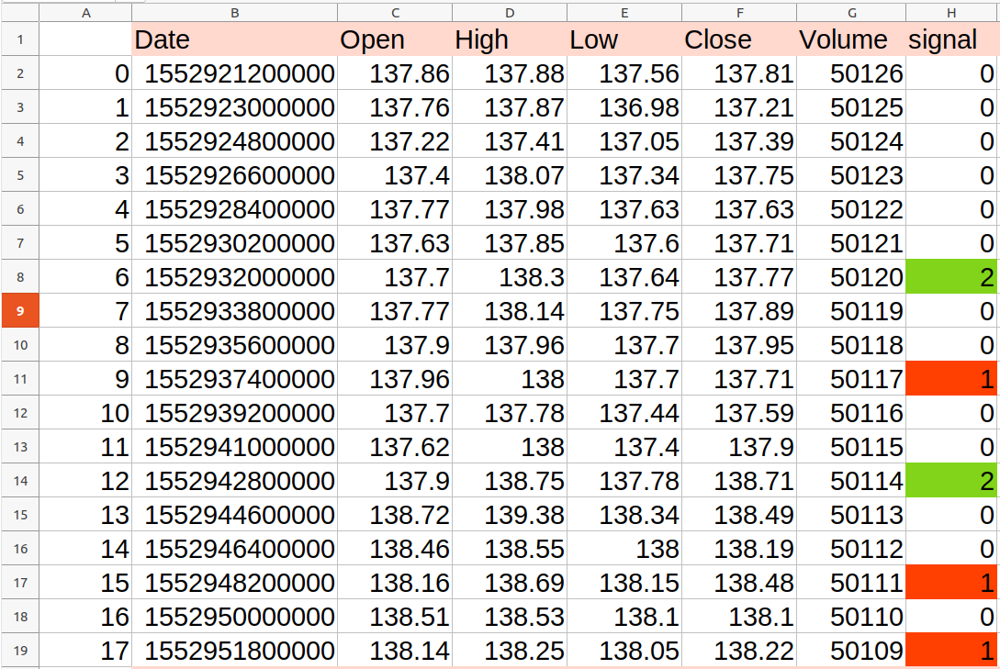

# Signal Backtester
 a small repo Based on  [Backtesting](https://pypi.org/project/Backtesting/) Lib .  
 easiest way to backtest your generated signal.
just need a csv file contain candleStick informations. OHLCV + signal
see [Dataset Structure](https://github.com/xibalbas/signal_backtester#strategy) for more information 

# why ?
some time writing good backtest for a strategy is not too easy . and you may had some challenge with backtest libraries.

so i decided to make a seprate repo for backtesting in easiest way.
what you need is a csv file contain `signal` column . for buy signal you should put `2`, and for sell signal you put `1`.

and good news is you did not need to write strategy for how trade we wrote it before you just choose yours and finish you did it :))
see [Strategy](https://github.com/xibalbas/signal_backtester#strategy) guide.

# Quick Start


## installation
```bash
pip install signal-backtester
```

## Usage
```python
from signal_backtester import SignalBacktester

# address of your dataset file 
# columns should include "Open, High, Low, Close, Volume, signal"

backtest = SignalBacktester(
                dataset="/home/xibalbas/sample.csv",
                strategy='two_side_sl_tp_reversed',
                cash=1000,
                commission=0.0005,  # equal 0.05 %
                percent_of_portfolio=99,
                stop_loss=1,
                take_profit=10,
                trailing_stop=3,    # if you are using trailing stop
                time_frame='30m', 
                output_path='.'     # path of result files
            )

backtest.run()
```

# strategy

available strategy to use are :

- **two_side_sl_tp_reversed**


this strategy open position in both side `buy` and `sell`. it close position with `stoploss` or `take profit`
also if you have an open `buy position` and you give a sell signal we close your last position an open new one

- **two_side_sl_trailing_reversed**


this strategy open position in both side `buy` and `sell`. it close position with `stoploss`. your stop loss is dynamic if price change your stop loss will change .
also if you have an open `buy position` and you give a sell signal we close your last position an open new one


- **one_side_buy_sl_tp**


this strategy open position just in one side `buy`. it close position with `stoploss` or `take profit`

- **one_side_sell_sl_tp**


this strategy open position just in one side `sell`. it close position with `stoploss` or `take profit`

- **one_side_buy_sl_trailing**


this strategy open position just in one side `buy`.  it close position with `stoploss`. your stop loss is dynamic if price change your stop loss will change .

- **one_side_sell_sl_trailing**


this strategy open position just in one side `sell`.  it close position with `stoploss`. your stop loss is dynamic if price change your stop loss will change .


# dataset structure
your data set structure should be like this table 

your buy signals should generate as 2
and your sell signals should generate as 1


you must have this columns in your dataset 
- Date
- Open
- High
- Low
- Close
- Volume
- signal




# Contributing

see contributing guide [here](https://github.com/xibalbas/signal_backtester/blob/master/CONTRIBUTING.md)


# License
`signal_backtester` is freely available under the MIT [license](https://github.com/xibalbas/signal_backtester/blob/master/LICENSE).
